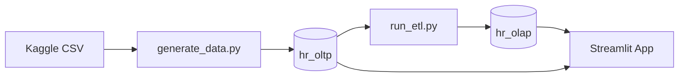

# HR Data Warehouse Mini Project

A dual-database HR analytics demo: **OLTP → ETL → OLAP star schema → Streamlit BI dashboard**.

- **hr_oltp** — operational source (employees, SCD2 history, projects, assignments)
- **hr_olap** — analytical warehouse (star schema with `dim_*` + `fact_employee_performance`)

Base employee metrics come from the [IBM HR Employee Attrition](https://www.kaggle.com/datasets/pavansubhasht/ibm-hr-analytics-attrition-dataset) Kaggle CSV. Names, emails, hire dates, history, and projects are synthesized on top.

## Architecture overview



See [diagrams/data-flow.md](diagrams/data-flow.md) for detailed phase diagrams, SCD2 sequence, and star-schema ERD.

## Prerequisites

- Python 3.11+
- MySQL 8.x (local)
- Kaggle CSV at `data_synthesizer/raw/WA_Fn-UseC_-HR-Employee-Attrition.csv`

## Setup

### 1. Clone and install

```powershell
cd "d:\Projects\HR Data WareHouse"
python -m venv venv
.\venv\Scripts\Activate.ps1
pip install -r requirements.txt
```

### 2. Configure database credentials

Copy `.env.example` to `.env` and set your MySQL password:

```env
DB_HOST=localhost
DB_PORT=3306
DB_USER=root
DB_PASSWORD=your_password
OLTP_DATABASE=hr_oltp
OLAP_DATABASE=hr_olap
```

### 3. Create schemas (MySQL Workbench or CLI)

Run in order:

1. `database/oltp_ddl.sql` — creates **hr_oltp** (5 tables)
2. `database/olap_ddl.sql` — creates **hr_olap** (5 tables)

**Workbench:** File → Open SQL Script → Execute  
**PowerShell:**

```powershell
Get-Content "database\oltp_ddl.sql" -Raw | & "C:\Program Files\MySQL\MySQL Server 8.3\bin\mysql.exe" -u root -p
Get-Content "database\olap_ddl.sql" -Raw | & "C:\Program Files\MySQL\MySQL Server 8.3\bin\mysql.exe" -u root -p
```

### 4. Load OLTP data

```powershell
python data_synthesizer\generate_data.py
```

**Expected output:**

```
departments: 3
employees: 1470
employee_history: ~3047
projects: 50
assignments: ~2901
Sanity check: exactly one is_current=TRUE row per employee_id
```

### 5. Run ETL into OLAP

```powershell
python run_etl.py
```

**Expected output:**

```
SCD2 rows to insert: 1470   (first run)
fact_employee_performance: 2901
dim_employee: 1470
```

Re-running on unchanged data should show `SCD2 rows to insert: 0` (idempotent).

### 6. Install stored procedures & run analytics (optional)

```powershell
Get-Content "database\stored_procedures.sql" -Raw | mysql -u root -p
```

Run individual queries from `database/analytical_queries.sql` in Workbench.

```sql
CALL hr_olap.GetDepartmentSalaryTrend('Sales');
```

### 7. Launch Streamlit dashboard

```powershell
streamlit run app/main.py
```

Open **http://localhost:8501** — use sidebar for **Add Employee** and **Dashboard**.

After adding employees in the app, run `python run_etl.py` again to refresh OLAP.

## Project structure

```
HR Data WareHouse/
├── data_synthesizer/
│   ├── generate_data.py          # Hybrid CSV ingest + synthesis → hr_oltp
│   └── raw/                      # Kaggle CSV
├── etl/
│   ├── extractor.py              # Read hr_oltp + CSV
│   ├── transformer.py            # SCD2 + fact build
│   └── loader.py                 # Write hr_olap
├── run_etl.py                    # ETL orchestrator
├── database/
│   ├── oltp_ddl.sql
│   ├── olap_ddl.sql
│   ├── stored_procedures.sql
│   └── analytical_queries.sql
├── app/
│   ├── main.py                   # Streamlit entrypoint
│   ├── db_connector.py           # SQLAlchemy wrapper (both DBs)
│   └── pages/
│       ├── 1_Add_Employee.py
│       └── 2_Dashboard.py
├── diagrams/
│   └── data-flow.md              # Mermaid architecture diagrams
├── requirements.txt
├── .env.example
└── README.md
```

## SCD Type 2 verification

Promote an employee in OLTP, then re-run ETL:

```sql
UPDATE hr_oltp.employee_history
SET effective_end = '2024-01-01', is_current = FALSE
WHERE employee_id = 2 AND is_current = TRUE;

INSERT INTO hr_oltp.employee_history
    (employee_id, role, salary, effective_start, effective_end, is_current)
VALUES (2, 'Manager', 6500.00, '2024-01-02', NULL, TRUE);

UPDATE hr_oltp.employees
SET current_role = 'Manager', current_salary = 6500.00
WHERE employee_id = 2;
```

```powershell
python run_etl.py
```

Verify in OLAP:

```sql
SELECT employee_key, employee_id, role, is_current, effective_start, effective_end
FROM hr_olap.dim_employee
WHERE employee_id = 2
ORDER BY effective_start;
```

You should see two rows: old role closed, new role current.

## Dashboard charts

| Chart | Source |
|-------|--------|
| Monthly attrition rate (line) | OLAP fact + CTE query |
| Headcount by department (bar) | OLAP star schema |
| Employee salary trend (line) | OLTP `employee_history` (SCD2) |
| Top employees by tenure (table) | Window function on OLAP fact |

## Troubleshooting

| Issue | Fix |
|-------|-----|
| `No database selected` (Error 1046) | Double-click **hr_olap** in Workbench Schemas, or use `hr_olap.table_name` |
| `Access denied for user 'root'` | Create `.env` with `DB_PASSWORD` |
| PowerShell `<` redirection fails | Use `Get-Content file.sql -Raw \| mysql -u root -p` |
| Dashboard empty | Run `python run_etl.py` after loading OLTP |
| `mysql` not found | Use full path: `C:\Program Files\MySQL\MySQL Server 8.3\bin\mysql.exe` |

## License

Educational / portfolio project. Kaggle dataset subject to its original license.
