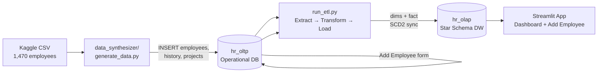
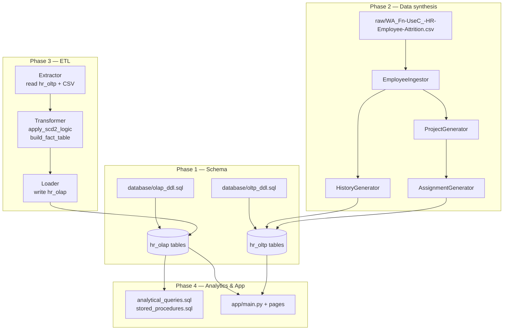
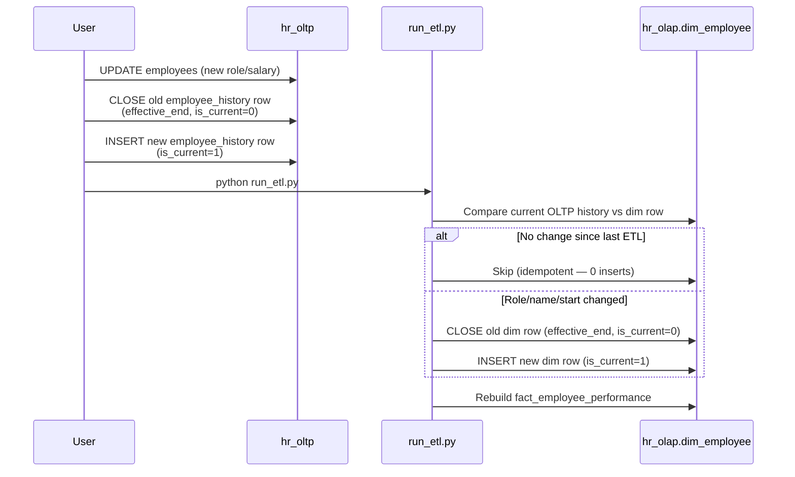
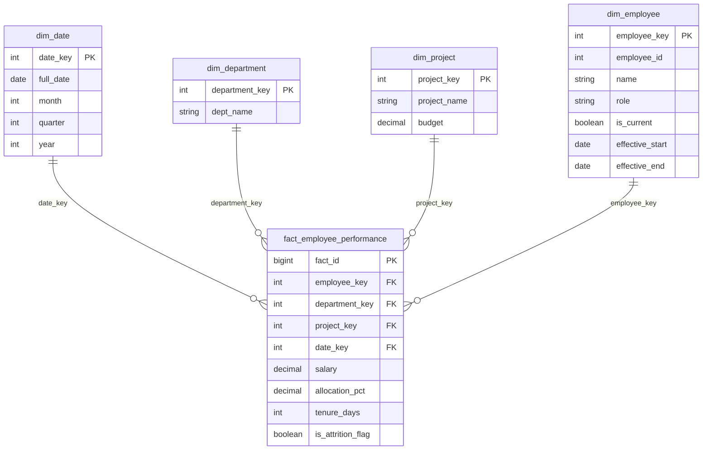
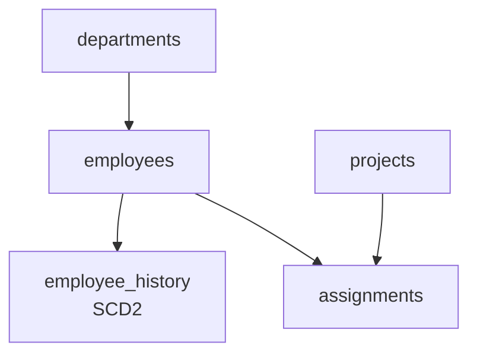

# HR Data Warehouse — Architecture & Data Flow

End-to-end flow for the HR Data Warehouse mini project.

## High-level pipeline

## Phase-by-phase detail

## SCD Type 2 flow (role / salary change)

When an employee is promoted in OLTP, both databases preserve history.

## Star schema (hr_olap)

## OLTP tables (hr_oltp)

## Typical run order

| Step | Command / file | Output |
|------|----------------|--------|
| 1 | `database/oltp_ddl.sql` | `hr_oltp` schema (5 tables) |
| 2 | `database/olap_ddl.sql` | `hr_olap` schema (5 tables) |
| 3 | `python data_synthesizer/generate_data.py` | ~1,470 employees in OLTP |
| 4 | `python run_etl.py` | Star schema populated |
| 5 | `database/stored_procedures.sql` | Procedures created |
| 6 | `database/analytical_queries.sql` | Ad-hoc analytics (optional) |
| 7 | `streamlit run app/main.py` | BI dashboard in browser |

After adding employees via the app, re-run step 4 to refresh the warehouse.
